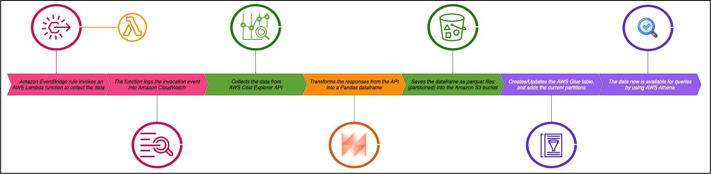

# aws-cost-explorer-data-collector

A serverless stack capable to collect data from AWS Cost Explorer API and publish as parquet into Amazon S3, serving it as a AWS Glue table for further queries

## Stack composition
- IAM service role (Lambda)
- AWS Lambda function
- Amazon EventBridge rule
- AWS Glue database

## Journey (process workflow)



## Requirements
- AWS Data Wrangler and AWS Lambda Powertools deployed as Lambda layers (recommended to deploy the packages by using the [commons-lambda-layers](https://github.com/lmassaoy/commons-lambda-layers) repository)
- AWS CLI installed
- IAM user configured in the AWS CLI with permissions to:
    - upload files into Amazon S3 bucket (store the zipped packages)
    - create AWS Lambda functions
    - create AWS Glue databases
    - create Amazon EventBridge rules
    - create IAM roles

## How to deploy the stack

There are 2 options to be followed in order to deploy the stack:
1. Editing the shell scripts (recommended for new users)
2. Passing the parameters as argments in the shell invocation

### Step 1

- Edit the shell script [cloudformation_package.sh](cloudformation/cloudformation_package.sh) including the bucket name where the zipped packages will be sent and the AWS CLI profile that will be used OR pass these parameters as argments
- Run the shell script:
    ```
    $ sh commons/cloudformation_package.sh
    ```
### Step 2

- Edit the shell script [cloudformation_deploy.sh](cloudformation/cloudformation_deploy.sh) including the bucket name where the packaged template will be sent, the AWS CLI profile that will be used, the CloudFormation stack name, and the chosen region OR pass these parameters as argments
- Run the shell script:
    ```
    $ sh commons/cloudformation_deploy.sh
    ```